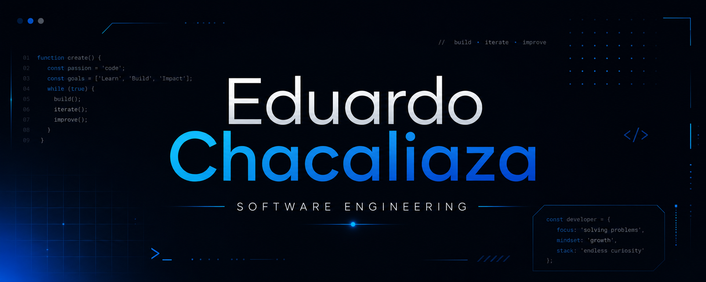

---

## About me

- Software Engineering student focused on full stack development.
- I build web applications, systems, desktop experiences and AI-powered products.
- I care about clean architecture, maintainable code and polished user experiences.

## Languages and tools

| Category | Icons |
| --- | --- |
| **Frontend** |  |
| **Backend** |  |
| **Database** |  |
| **Desktop / AI** |   |
| **Tools** |  |

---

## Current focus

- Building production-ready full stack projects.
- Exploring AI integrations for productivity and automation.
- Developing web and desktop applications with modern technologies.

---

## Quick stats

---

## Contact

